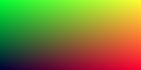

# CSharpSimpleRayTracer

A Simple Ray tracer written in C# based on the book Ray Tracing in one Weekend by Peter Shirly. 

I am writing this ray tracer for my own enjoyment, choosing to write it in C# as that's the language I use in my day job (and I want an excuse to use it on a mac at home). The goal for this project is to generate some nice looking pictures, I prefer simple code to optimised code and am not concerned with having a slow renderer.

I am a big fan of Test Driven Development so will endeavour to write tests first and only commit where all tests pass. In Peter's book he suggests outputting images in PPM format where each pixel is described in ASCII text. I will follow suit internally but will use the ImageMagik library to convert the output to a PNG at the last moment.

## Chapter 1

The first few commits are just about getting the project set up. Visual Studio for Mac didn't auto detect tests written in nUnit so I created a project in xUnit and removed all references to xUnit after pulling down nUnit from nuget. I then made sure I could export PPM files as PNG by writing a test that generates a gradient image as in Peter's book:

## Chapter 2

Now I have introduced some classes to do basic maths. I don't like the approach in Peter's book of having a generic Vec3 class for representing points, colours etc so I have put all the functionality in an abstract class with appropriate concrete implementations for type safety.

## Chapter 3

I spent a lot of time thinking about whether my approach to abstraction was appropriate or overkill. Because I wanted the each object to be more or less immutable every maths operation needed to return a new instance of its type. If all the basic vector maths was inside an abstract class I could not see a reasonable way for the abstract classes to return new objects of the correct type. In the end I decided to re-align myself with the code in the book and have a simple Vec3 class for all vector maths.

In terms of pushing the project forward I was able to get the system to paint a plain sky like background by linearly interpolating between shades of blue:

## Chapter 4

I did quite a lot of refactoring before getting into the objective for this chapter. I decided that since I was working in .NET I would use the features the framework has out of the box, namely the BitMap and Color classes. I have ditched support for PPM since I can address each pixel of a BitMap instance and it will output a png image on request. I also discovered Azure Devops to do some continuous integration but have so far been unsuccessful getting my project to compile on an Azure machine.

The objective for this chapter was to draw our first shape in the ray tracer. My maths skills are not brilliant but on a conceptual level I understand how using the quadratic equation with the formula for a circle and seeing if a ray intersects by determining if it has a valid value for X, but I don't fully understand how each term in the quadratic equation maps to the circle formula. Nonetheless I implemented the function from the book and got the following:

## Chapter 5

In this chapter I have started to shade the sphere. THe book suggests shading by using the normal. To get the normal I need the distance the ray travels until it hits a surface. Using the quadratic equation and solving for x gives us the distance the ray travels (t) until it hits the surface. We can then use the ray and the parameter t to get the surface point. The normal is simply the vector between the surface point and the centre of the sphere. I have used the normals in order to colour the sphere, but my result differs slightly against the book as my x axis is inverted:

I preempted the need to consider 3D scene objects as objects in the OOP sense so I had created a Sphere class with the properties and behaviours needed to render a sphere based on the work so far. Since lists are trivial in .NET and the book suggests making a list of hittable objects, I added an extra sphere to make a ground plain and gave it a render:

I have obviously forgotten to take into account any kind of z-sorting!